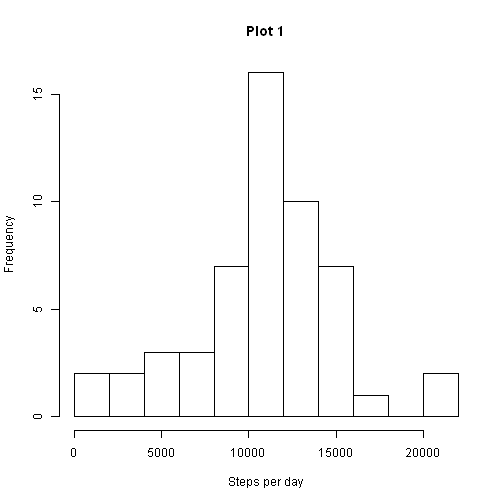
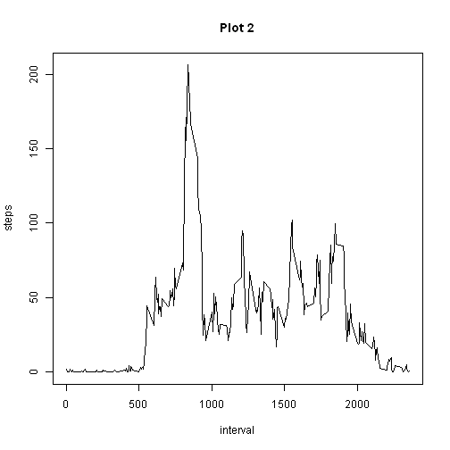
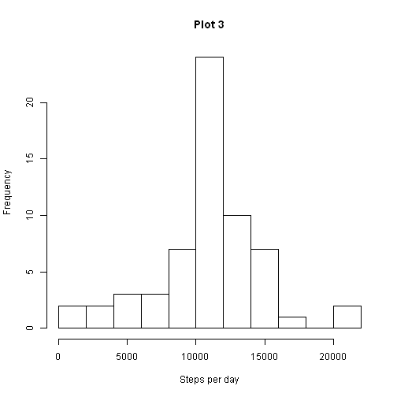
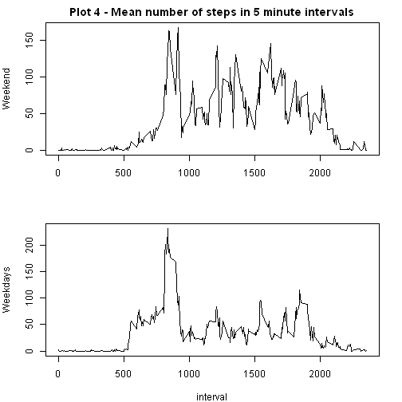

Reproducible Research Project1
==============================

## Data

The data for this assignment can be downloaded from the course web site:

Data set: [Activity monitoring data](https://d396qusza40orc.cloudfront.net/repdata%2Fdata%2Factivity.zip) [52K]

The variables included in this data set are:

steps: Number of steps taking in a 5-minute interval (missing values are coded as NA)

date: The date on which the measurement was taken in YYYY-MM-DD format

interval: Identifier for the 5-minute interval in which measurement was taken

The data set is stored in a comma-separated-value (CSV) file and there are a total of 17,568 observations in this data set

### This project addresses the following questions;

* What is mean total number of steps taken per day?
* What is the average daily activity pattern?
* Are there differences in activity patterns between weekdays and weekends?

### Loading and pre-processing the data


```r
activity <- read.csv("activity.csv")
activity$date <- as.Date(as.character(activity$date), format = "%d/%m/%Y")
```

### First analysis - ignoring missing data (eight complete days worth of data are missing)


```r
#table of steps per day with NA days removed
dailysteps <- aggregate(steps ~ date, activity, sum)
hist(dailysteps$steps, breaks = 10, xlab = "Steps per day", main = "Plot 1")
```

 

```r
meanDS <- format(mean(dailysteps$steps), scientific = FALSE)
medianDS <- median(dailysteps$steps)
```

Mean number of daily steps is 10766  
Median number of daily steps is 10765

### Average daily activity pattern ignoring missing data


```r
stepsperperiod <- aggregate(steps ~ interval, activity, mean)
plot(stepsperperiod, type = "l", main = "Plot 2")
```

 

```r
maxsteps <- round(max(stepsperperiod$steps))
maxint <- stepsperperiod[which(stepsperperiod$steps == max(stepsperperiod$steps)),1]
```

The highest mean number of steps in a 5 minute period was 206 in the interval commencing at 835.

## Imputing missing values


```r
activna <- is.na(activity$steps)
missing <- sum(activna)
```

There are 8 complete days of missing values, totaling 2304 missing data points.  Missing days' data will replaced by the mean daily values for each interval.


```r
# fillvec will be a vector with mean steps in place of NAs and zeros otherwise.  Mean values are not rounded and so non integer values indicate imputed data.
fillvec <- is.na(activity$steps) * stepsperperiod$steps
newdf <- activity # copy of activity data frame to avoid overwriting original data file

# set NAs to zero, then merge fillvec with original data
for(i in 1:17568){if(activna[i] == TRUE){newdf$steps[i] <- 0}}
newdf$steps <- newdf$steps + fillvec

newds <- aggregate(steps ~ date, newdf, sum)
hist(newds$steps, breaks = 10, xlab = "Steps per day", main = "Plot 3")
```

 

```r
newmeanDS <- format(mean(newds$steps), scientific = FALSE)
newmedianDS <- format(median(newds$steps), scientific = FALSE)
```

After replacing NAs, Mean number of daily steps is 10766 and median number of daily steps is 10766 - previously 10766 and 10765 respectively.

## Comparison of activity patterns between weekdays and weekends


```r
days <- weekdays(newdf$date)
weekend <- as.logical((days == "Saturday") + (days == "Sunday"))

wdactivity <- newdf[!weekend,]
weactivity <- newdf[weekend,]

wdsteps <- aggregate(steps ~ interval, wdactivity, mean)
westeps <- aggregate(steps ~ interval, weactivity, mean)


par(mfrow = c(2,1), mar = c(4,4,2,2))
plot(westeps, type = "l", xlab = "", ylab = "Weekend", main = "Plot 4 - Mean number of steps in 5 minute intervals")
plot(wdsteps, type = "l", ylab = "Weekdays")
```

 

```r
meanwd <- round(mean(wdsteps$steps),2)
meanwe <- round(mean(westeps$steps),2)
```


Mean number of steps per 5 minute interval is 35.61 during the week compared with 42.37 at weekends.  Plot 4 shows that while weekends start more slowly, activity is clearly higher throughout the day.

